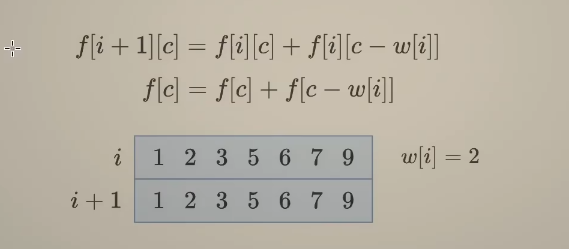

# 动态规划

动态规划问题很多时候可以用前面回溯的思路：选或者不选/选哪个来获取思路

比如我们考虑`打家劫舍`这道题，我们先从回溯的思路考虑，回溯一般是从第一个或者最后一个问题考虑，这样受到的约束会小

下面就是用回溯的思路思考这道题[198. 打家劫舍 - 力扣（LeetCode）](https://leetcode.cn/problems/house-robber/description/)

- 当前操作：枚举**第**$i$个房子选还是不选
- 子问题？从**前**$i$个房子中得到的最大金额和
- 下一个子问题？分类讨论：
  - 不选：从**前**$i - 1$个房子中得到的最大金额和
  - 选：从**前**$i - 2$个房子中得到的最大金额和

```python
dfs(i) = max(dfs(i - 1), dfs(i - 2) + nums[i])
```

由于回溯的时间复杂度是指数级别的，所以肯定会超时，需要优化这里的代码，实际上就是将用过的`dfs(i)`保存到一个`cache`数组中，这样可以降低复杂度到$O(n)$

首先是**python**语言可以直接用装饰器

```python
class Solution:
    def rob(self, nums: List[int]) -> int:
        @cache
        def dfs(i):
            if i < 0:
                return 0
            return max(dfs(i - 1), dfs(i - 2) + nums[i])
        return dfs(len(nums) - 1) # 这里肯定是len(nums) - 1，因为要用到nums[i]不能越界
```

用`cache`数组来写

```python
class Solution:
    def rob(self, nums: List[int]) -> int:
        n = len(nums)
        cache = [-1] * n
        def dfs(i):
            if i < 0:
                return 0
            if cache[i] != -1:
                return cache[i]
            cache[i] = max(dfs(i - 1), dfs(i - 2) + nums[i])
            return cache[i] 
        return dfs(len(nums) - 1) # 这里肯定是len(nums) - 1，因为要用到nums[i]不能越界
```

接下来就是从递归到递推的过程

自顶向下算：记忆化搜索

自底向上算：递推

1：1翻译成递推

- `dfs`->`f`数组
- 递归->循环
- 递归边界->循环初始值

```python
dfs(i) = max(dfs(i - 1), dfs(i - 2) + nums[i])
f[i] = max(f[i - 1], f[i - 2] + nums[i]) 
f[i + 2] = max(f[i + 1], f[i] + nums[i]) # 下标防止越界的写法
```

递推写法

```python
class Solution:
    def rob(self, nums: List[int]) -> int:
        n = len(nums)
        f = [0] * (n + 2)
        for i in range(n):
            f[i + 2] = max(f[i + 1], f[i] + nums[i])
        return f[-1]
```

空间优化版本

```python
class Solution:
    def rob(self, nums: List[int]) -> int:
        # 获取房屋数量
        n = len(nums)
        # 初始化前 i-1 个房屋和前 i 个房屋中偷盗后的最大金额
        f0 = f1 = 0 
        # 遍历每一个房屋的价值
        for x in nums:
            # 计算在当前房屋被偷盗和不被偷盗两种情况下的最大偷盗金额
            new_f = max(f1, f0 + x)
            # 更新前 i-1 个房屋偷盗后的最大金额
            f0 = f1
            # 更新前 i 个房屋偷盗后的最大金额
            f1 = new_f      
        # 返回最后一个房屋偷盗后的最大金额
        return f1
```

## 记忆化搜索到递推

#### [70. 爬楼梯 - 力扣（LeetCode）](https://leetcode.cn/problems/climbing-stairs/)

记忆化搜索版本
```python
class Solution:
    def climbStairs(self, n: int) -> int:
        @cache
        def dfs(i):
            if i <= 1:
                return 1
            return dfs(i - 1) + dfs(i - 2)
        return dfs(n)
```

递推版本

```python
class Solution:
    def climbStairs(self, n: int) -> int:
        f = [0] * (n + 1)
        f[0] = f[1] = 1
        for i in range(2, n + 1):
            f[i] = f[i - 1] + f[i - 2]
        return f[-1]
```

#### [746. 使用最小花费爬楼梯 - 力扣（LeetCode）](https://leetcode.cn/problems/min-cost-climbing-stairs/description/)

#### [377. 组合总和 Ⅳ - 力扣（LeetCode）](https://leetcode.cn/problems/combination-sum-iv/description/)

#### [2466. 统计构造好字符串的方案数 - 力扣（LeetCode）](https://leetcode.cn/problems/count-ways-to-build-good-strings/description/)

#### [2266. 统计打字方案数 - 力扣（LeetCode）](https://leetcode.cn/problems/count-number-of-texts/description/)

#### [740. 删除并获得点数 - 力扣（LeetCode）](https://leetcode.cn/problems/delete-and-earn/description/)

#### [2320. 统计放置房子的方式数 - 力扣（LeetCode）](https://leetcode.cn/problems/count-number-of-ways-to-place-houses/description/)

#### [213. 打家劫舍 II - 力扣（LeetCode）](https://leetcode.cn/problems/house-robber-ii/description/)

## 背包问题

### 01背包

0-1背包：有$n$个物品，第$i$个物品的体积为$w[i]$，价值为$v[i]$，每个物品至多选一个，求体积和不超过$capacity$​时的最大价值和

回溯三问：

- 当前操作：枚举第$i$个物品选或者不选，不选，剩余容量不变，选，剩余容量减少$w[i]$
- 子问题：在容量为$c$时，从**前**$i$个物品中得到的最大价值和
- 下一个子问题？分类讨论：不选：在剩余容量为$c$时，从前$i - 1$个物品中得到的最大价值和，选：在剩余容量为$c-w[i]$时，从前$i - 1$个物品中得到的最大价值和 

```python
dfs(i, c) = max(dfs(i - 1, c), dfs(i - 1, c - w[i]) + v[i])
```

#### **0-1**背包模板代码

```python
@cache
def dfs(i, c):
    if i < 0: # 如果没有物品可以选了就返回0
        return 0
    if c < w[i]: # 如果当前背包容量小于c，就不选当前物品
        return dfs(i - 1, c)
    return max(dfs(i - 1, c), dfs(i - 1, c - w[i]) + v[i])
```

#### 常见变形：

#### 常见变形：

- 至多装$capacity$，求方案数/最大价值和
- **恰好**装$capacity$，求方案数/最大/**最小价值和**
- 至少装$capacity$​​，求方案数/最小价值和

下面是具体代码写法

- 至多装$capacity$，求方案数/最大价值和

```python
# 至多装 capacity，求方案数
@cache
def dfs_max_capacity_count(i, c):
    if i < 0:  # 如果没有物品可以选了就返回0
        return 1 if c == 0 else 0  # 如果背包容量为0则方案数为1，否则为0
    if c < w[i]:  # 如果当前背包容量小于物品 i 的重量，就不选当前物品
        return dfs_max_capacity_count(i - 1, c)
    return dfs_max_capacity_count(i - 1, c) + dfs_max_capacity_count(i - 1, c - w[i])

# 至多装 capacity，求最大价值和
@cache
def dfs_max_capacity_value(i, c):
    if i < 0:  # 如果没有物品可以选了就返回0
        return 0
    if c < w[i]:  # 如果当前背包容量小于物品 i 的重量，就不选当前物品
        return dfs_max_capacity_value(i - 1, c)
    return max(dfs_max_capacity_value(i - 1, c), dfs_max_capacity_value(i - 1, c - w[i]) + v[i])


```

- 恰好装$capacity$，求方案数/最大/最小价值和

```python
# 恰好装 capacity，求方案数
@cache
def dfs_exact_capacity_count(i, c):
    if i < 0:  # 如果没有物品可以选了就返回0
        return 1 if c == 0 else 0  # 如果背包容量为0则方案数为1，否则为0
    if c < w[i]:  # 如果当前背包容量小于物品 i 的重量，就不选当前物品
        return dfs_exact_capacity_count(i - 1, c)
    return dfs_exact_capacity_count(i - 1, c) + dfs_exact_capacity_count(i - 1, c - w[i])

# 恰好装 capacity，求最大价值和
@cache
def dfs_exact_capacity_max_value(i, c):
    if i < 0:  # 如果没有物品可以选了就返回0
        return 0 if c != 0 else float('-inf')  # 如果背包容量不为0，则价值为负无穷，否则为0
    if c < w[i]:  # 如果当前背包容量小于物品 i 的重量，就不选当前物品
        return dfs_exact_capacity_max_value(i - 1, c)
    return max(dfs_exact_capacity_max_value(i - 1, c), dfs_exact_capacity_max_value(i - 1, c - w[i]) + v[i])

# 恰好装 capacity，求最小价值和
@cache
def dfs_exact_capacity_min_value(i, c):
    if i < 0:  # 如果没有物品可以选了就返回0
        return 0 if c != 0 else float('inf')  # 如果背包容量不为0，则价值为正无穷，否则为0
    if c < w[i]:  # 如果当前背包容量小于物品 i 的重量，就不选当前物品
        return dfs_exact_capacity_min_value(i - 1, c)
    return min(dfs_exact_capacity_min_value(i - 1, c), dfs_exact_capacity_min_value(i - 1, c - w[i]) + v[i])
```

- 至少装$capacity$，求方案数/最小价值和

```python
# 至少装 capacity，求方案数
@cache
def dfs_at_least_capacity_count(i, c):
    if i < 0:  # 如果没有物品可以选了就返回0
        return 1 if c == 0 else 0  # 如果背包容量为0则方案数为1，否则为0
    if c < w[i]:  # 如果当前背包容量小于物品 i 的重量，就不选当前物品
        return dfs_at_least_capacity_count(i - 1, c)
    return dfs_at_least_capacity_count(i - 1, c) + dfs_at_least_capacity_count(i - 1, c - w[i])

# 至少装 capacity，求最小价值和
@cache
def dfs_at_least_capacity_min_value(i, c):
    if i < 0:  # 如果没有物品可以选了就返回0
        return 0 if c != 0 else float('inf')  # 如果背包容量不为0，则价值为正无穷，否则为0
    if c < w[i]:  # 如果当前背包容量小于物品 i 的重量，就不选当前物品
        return dfs_at_least_capacity_min_value(i - 1, c)
    return min(dfs_at_least_capacity_min_value(i - 1, c), dfs_at_least_capacity_min_value(i - 1, c - w[i]) + v[i])
```

递归转化成递推

```python
dfs(i, c) = dfs(i - 1, c)+ dfs(i - 1, c - w[i])
f[i][c] = f[i - 1][c] + f[i - 1][c - w[i]]
f[i + 1][c] = f[i][c] + f[i][c - w[i]]
```

#### [494. 目标和 - 力扣（LeetCode）](https://leetcode.cn/problems/target-sum/description/)

类型：恰好装满求方案数

```py
class Solution:
    def findTargetSumWays(self, nums: List[int], target: int) -> int:
        target += sum(nums)
        if target % 2 or target < 0:
            return 0
        target //= 2
        @cache
        def dfs(i, c):
            if i < 0:
                return 1 if c == 0 else 0
            if c < nums[i]:
                return dfs(i - 1, c)
            return dfs(i - 1, c) + dfs(i - 1, c - nums[i])
        return dfs(len(nums) - 1, target)
# 翻译成递推，未优化空间版本
class Solution:
    def findTargetSumWays(self, nums: List[int], target: int) -> int:
        target += sum(nums)
        if target % 2 or target < 0:
            return 0
        target //= 2
        n = len(nums)
        f = [[0] * (target + 1) for _ in range(n + 1)]
        f[0][0] = 1 # 这个边界条件可以从递归那里判断
        for i, x in enumerate(nums):
            for c in range(target + 1):
                if c < x:
                    f[i + 1][c] = f[i][c]
                else:
                    f[i + 1][c] = f[i][c] + f[i][c - x]
        return f[n][target]
# 滚动数组优化成二维空间
class Solution:
    def findTargetSumWays(self, nums: List[int], target: int) -> int:
        target += sum(nums)
        if target % 2 or target < 0:
            return 0
        target //= 2
        n = len(nums)
        f = [[0] * (target + 1) for _ in range(2)]
        f[0][0] = 1 # 这个边界条件可以从递归那里判断
        for i, x in enumerate(nums):
            for c in range(target + 1):
                if c < x:
                    f[(i + 1) % 2][c] = f[i % 2][c]
                else:
                    f[(i + 1) % 2][c] = f[i % 2][c] + f[i % 2][c - x]
        return f[n % 2][target]

```

可以看下面是滚动数组的分析，因为每次算新的$f[i + 1][c]$实际上只用到了前一个$f[i]$所以实际上我们只需要二维数组就行


优化到一个数组



我们考虑正序枚举的情况，就是$f[c]=f[c] + f[c-w[i]]$

我们看第一列，就是$1+3->4\quad2+5->7$，但是我们要写第三个的时候如果正常的是$3 +6->9$，但是这里的3实际上已经被更新成了$4$，所以不应该正序枚举

我们考虑倒序枚举$9+6->15 \quad7 + 5->12\quad 6 + 3->9$，我们可以发现倒序枚举没有任何问题，所以就可以优化到1维了

```python
class Solution:
    def findTargetSumWays(self, nums: List[int], target: int) -> int:
        target += sum(nums)
        if target % 2 or target < 0:
            return 0
        target //= 2
        n = len(nums)
        f = [1] + [0] * target
        for x in nums:
            for c in range(target, x - 1, -1):
                    f[c] = f[c] + f[c - x]
        return f[target]0
```


### 完全背包

完全背包：有$n$种物品，第$i$种物品的体积为$v[i]$，价值为$w[i]$，每个物品无限次重复选，求体积和不超过$capacity$时的最大价值和

回溯三问：

- 当前操作：枚举**第**$i$种物品选一个或者不选
  - 不选：剩余容量不变；选一个：剩余容量减少$w[i]$

- 子问题：在剩余容量为$c$时，从前$i$种物品种得到的最大价值和
- 下一个子问题：分类讨论：
  - 不选：在剩余容量为$c$时，从**前**$i-1$种物品中得到的最大价值和
  - 选一个：在剩余容量为$c-w[i]$时，从**前**$i$中物品中得到的最大价值和

```python
dfs(i,c) = max(dfs(i - 1,c), dfs(i, c - w[i]) + v[i]) # 注意这里后面那个是dfs(i, c - w[i])，没有i - 1
```

#### 完全背包模板代码

```python
@cache
def dfs(i, c):
    if i < 0:
        return 0
    if c < w[i]:
        return dfs(i - 1, c)
    return max(dfs(i - 1, c), dfs(i, c - w[i]) + v[i])
```


#### [322. 零钱兑换 - 力扣（LeetCode）](https://leetcode.cn/problems/coin-change/description/)

类型：恰好装满，求最小价值和，把每一个硬币的价值都看成$1$

```py
class Solution:
    def coinChange(self, coins: List[int], amount: int) -> int:
        # 相当于v[i] = 1，求最小价值和
        @cache
        def dfs(i, c):
            if i < 0:
                return 0 if c == 0 else inf # 这里如果c!=0的话，用inf的话，后面取min就可以忽略了
            if c < coins[i]:
                return dfs(i - 1, c)
            return min(dfs(i - 1, c), dfs(i, c - coins[i]) + 1)
        ans = dfs(len(coins) - 1, amount)
        return ans if ans < inf else -1
```

递推写法和简单空间优化

```python
class Solution:
    def coinChange(self, coins: List[int], amount: int) -> int:
        n = len(coins)
        f = [[inf] * (amount + 1) for _ in range(n + 1)]
        f[0][0] = 0
        for i, x in enumerate(coins):
            for c in range(amount + 1):
                if c < x:
                    f[i + 1][c] = f[i][c]
                else:
                    f[i + 1][c] = min(f[i][c], f[i + 1][c - x] + 1)
        ans = f[n][amount]
        return ans if ans < inf else -1
class Solution:
    def coinChange(self, coins: List[int], amount: int) -> int:
        n = len(coins)
        f = [[inf] * (amount + 1) for _ in range(2)]
        f[0][0] = 0
        for i, x in enumerate(coins):
            for c in range(amount + 1):
                if c < x:
                    f[(i + 1) % 2][c] = f[i % 2][c]
                else:
                    f[(i + 1) % 2][c] = min(f[i % 2][c], f[(i + 1) % 2][c - x] + 1)
        ans = f[n % 2][amount]
        return ans if ans < inf else -1

```

优化到一维的空间写法

这里的优化到一维不需要倒序枚举，因为$f[i + 1][c] = min(f[i][c], f[i + 1][c - x] + 1)$,后面那个也是$f[i+1]][c-x]$，所以更新之后的就是对的，因为0-1背包我们不需要

```python
class Solution:
    def coinChange(self, coins: List[int], amount: int) -> int:
        f = [0] + [inf] * amount
        for x in coins:
            for c in range(x, amount + 1):
                f[c] = min(f[c], f[c - x] + 1)
        ans = f[amount]
        return ans if ans < inf else -1
```

## 最长公共子序列(LCS)

最长公共子序列考虑的是两个字符串的最长公共子序列问题

子序列问题本质上就是**选或者不选**，考虑最后一对对应字母$x$，$y$，我们可以得到下面这四种选择

- 不选$x$不选$y$
- 不选$x$选$y$
- $x$不选$y$
- 选$x$选$y$

回溯三问：

- 当前操作：考虑$s[i]$和$t[j]$选或者不选
- 子问题：$s$的前$i$个字母和$t$的前$j$个字母的$LCS$长度
- 下一个子问题：
  - $s$的前$i-1$个字母和$t$的前$j-1$个字母的$LCS$长度
  - $s$的前$i-1$个字母和$t$的前$j$个字母的$LCS$​长度
  - $s$的前$i$个字母和$t$的前$j - 1$ 个字母的$LCS$长度

```python
dfs(i, j) = max(dfs(i - 1, j), dfs(i, j - 1), dfs(i - 1, j - 1) + s[i] == t[j])
```

可以详细写出下面这两种

```python
dfs(i, j) = dfs(i - 1, j - 1) + 1 # s[i] == t[j]
dfs(i, j) = max(dfs(i - 1, j), dfs(i, j - 1)) # s[i] != t[j]
f[i][j] = f[i - 1][j - 1] + 1 # s[i] == t[j]
f[i][j] = max(f[i - 1][j], f[i][j - 1]) # s[i] != t[j]
```

