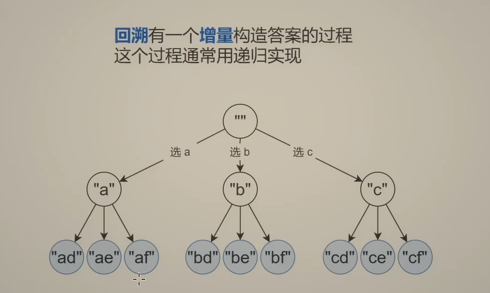

## 回溯

回溯问题可以分为子集型回溯，组合型回溯，排列型回溯。下面首先讲解一下回溯问题的通用思考思路，再分别对这三种问题进行分析

回溯的出现是为了解决单纯的循环无法解决的问题，就像下面的循环，我们想分别用这些字母选出对应字符串，如果循环次数小且已知，我们可以用循环来代替，但是循环比较多，或者说循环次数就是一个参数，这样循环就解决不了了，这个时候就需要用到递归了

递归解决的就是一个增量构造答案的过程，如果就像下面原问题和子问题是类似的，就可以用递归来实现，就像下图

原问题：构造长度为$n$的字符串

​		枚举一个字母

子问题：构造长度为$n-1$的字符串

```python
for x in "abc":
    for y in "def":
        ....
```



我们在思考这种递归问题的时候，应该避免深入思考太多层次，需要思考的就是边界条件和非边界条件的逻辑，如果这个逻辑能够正确，递归的实施和正确性用数学归纳法就可以保证了

所以这里就学习灵神的递归三问：

- 当前操作是什么：比如说枚举字符串的第$i$个字母
- 子问题是什么：构造字符串$\geq i$的部分
- 下一个子问题：构造字符串$\geq i + 1$的部分

### 子集型回溯

子集型回溯，故名思意就是从所给的列表中选出所有满足要求的子集，比如常见的就是$[1, 2, 3]$求所有子集

子集型回溯的常见思考思路有两种，分别是从输入视角考虑和从答案视角考虑

输入视角考虑：比如这个子集问题，站在输入视角考虑，每个数可以选也可以不选，选和不选都可以作为答案子集，体现在代码上就是

```cpp
dfs(i + 1) # 不选当前这个
path.append(nums[i]) # 选当前这个数
dfs(i + 1)
path.pop() # 恢复现场
```

答案视角考虑：还是考虑这个子集问题，站在答案视角考虑，就是枚举第一个数选谁，选第一个还是第二个，体现在代码上就是

```python
for j in range(i, n):
    path.append(nums[j])
    dfs(j + 1)
    path.pop()
```

还有一个问题就是需不需要回溯现场，这取决于你是固定了`path`的大小的还是没固定的，固定了大小的就不用回溯，因为后面哪个会覆盖前面写入的值，没有固定大小的，需要用`append`和`pop`来回溯

#### [78. 子集 - 力扣（LeetCode）](https://leetcode.cn/problems/subsets/description/)

输入视角考虑：每个数可以选还是不选

```python
class Solution:
    def subsets(self, nums: List[int]) -> List[List[int]]:
        ans = []
        path = []
        n = len(nums)
        def dfs(i):
            if i == n:
                ans.append(path.copy()) # 还有这个一定要写copy
                return # 回溯问题一定不要忘记return
            dfs(i + 1)
            path.append(nums[i])
            dfs(i + 1)
            path.pop()
        dfs(0)
        return ans
```

答案视角考虑：枚举当前该选哪一个数，需要注意的是如果从答案视角考虑，每一个`path`在递归中都要加入答案

```python
class Solution:
    def subsets(self, nums: List[int]) -> List[List[int]]:
        ans = []
        path = []
        n = len(nums)
        def dfs(i):
            ans.append(path.copy()) # 因为从答案视角考虑，所以每一个都要先加入答案
            if i == n:
                return
            for j in range(i, n):
                path.append(nums[j])
                dfs(j + 1)
                path.pop()
        dfs(0)
        return ans
```

#### [131. 分割回文串 - 力扣（LeetCode）](https://leetcode.cn/problems/palindrome-partitioning/description/)

输入视角考虑：我们假设每个字符之间都有一个逗号$abc$->$a, b, c$，我们枚举每一个逗号选还是不选

```python
class Solution:
    def partition(self, s: str) -> List[List[str]]:
        ans = []
        path = []
        n = len(s)

        # start 表示当前这段回文子串的开始位置
        def dfs(i: int, start: int) -> None:
            if i == n:
                ans.append(path.copy())  # 复制 path
                return

            # 不选 i 和 i+1 之间的逗号（i=n-1 时一定要选）
            if i < n - 1:
                dfs(i + 1, start)

            # 选 i 和 i+1 之间的逗号（把 s[i] 作为子串的最后一个字符）
            t = s[start: i + 1]
            if t == t[::-1]:  # 判断是否回文
                path.append(t)
                dfs(i + 1, i + 1)  # 下一个子串从 i+1 开始
                path.pop()  # 恢复现场

        dfs(0, 0)
        return ans
```

答案视角考虑：枚举每一个子串的结束位置

```python
class Solution:
    def partition(self, s: str) -> List[List[str]]:
        ans = []
        path = []
        n = len(s)
        def dfs(i):
            if i == n:
                ans.append(path.copy())
            for j in range(i, n):
                t = s[i: j + 1]
                if t == t[::-1]:
                    path.append(t)
                    dfs(j + 1)
                    path.pop()
        dfs(0)
        return ans
```

#### [784. 字母大小写全排列 - 力扣（LeetCode）](https://leetcode.cn/problems/letter-case-permutation/description/)

输入视角：枚举每个字母是变大小写还是不变

```cpp
class Solution {
public:
    char change(char c)
    {
        if(c >= 'a' && c <= 'z')
            return toupper(c);
        if(c >= 'A' && c <= 'Z')
            return tolower(c);
        return 'a';
    }
    vector<string> letterCasePermutation(string s) {
        vector<string> ans;
        string temp = s;
        int n = s.size();
        function<void(int)> dfs = [&](int i)
        {
            if(i == n)
            {
                ans.push_back(temp);
                return;
            }
            dfs(i + 1);
            if(isalpha(s[i]))
            {
                temp[i] = change(temp[i]);
                dfs(i + 1);
                temp[i] = change(temp[i]);
            }
        };
        dfs(0);
        return ans;
    }
};
```

答案视角：枚举选哪个字符来变大或者变小

```python
class Solution {
public:
    vector<string> letterCasePermutation(string s) {
        int n = s.size();
        vector<string> ans;
        string temp = s;
        function<void(int)> dfs = [&](int i)
        {
            ans.push_back(temp);
            for(int j = i; j < n; j ++)
            {
                if(isalpha(temp[j]))
                {
                    temp[j] ^= ' ';
                    dfs(j + 1);
                    temp[j] ^= 32;
                }
            }
        };
        dfs(0);
        return ans;
    }
};
```

#### [LCP 51. 烹饪料理 - 力扣（LeetCode）](https://leetcode.cn/problems/UEcfPD/description/)（待完成）

#### [2397. 被列覆盖的最多行数 - 力扣（LeetCode）](https://leetcode.cn/problems/maximum-rows-covered-by-columns/description/)

输入视角：枚举每一列是选还是不选

```cpp
class Solution {
public:
    int maximumRows(vector<vector<int>>& matrix, int numSelect) {
        //选或者不选
        int res = 0, n = matrix.size(), m = matrix[0].size();
        vector<int> mask(m, 0);
        function<int()> check = [&]()
        {
            int cnt = 0;
            for(int i = 0; i < n; i++)
            {
                bool flag = 1;
                for(int j = 0; j < m; j++)
                    if(!mask[j] && matrix[i][j] == 1) 
                    {
                        flag = 0;
                        break;
                    }
                if(flag) cnt++;
            }
                
            return cnt;
        };
        function<void(int, int)> dfs = [&](int i, int cnt)
        {
            if(i == m)
            {
                if(cnt == numSelect)
                    res = max(res, check());
                return;
            }
            mask[i] = 1;
            dfs(i + 1, cnt + 1);
            mask[i] = 0;
            dfs(i + 1, cnt);
        };
        dfs(0, 0);
        return res;
    }
};
```

答案视角：枚举选哪一列

#### [2151. 基于陈述统计最多好人数 - 力扣（LeetCode）](https://leetcode.cn/problems/maximum-good-people-based-on-statements/description/)（待完成）

#### [1601. 最多可达成的换楼请求数目 - 力扣（LeetCode）](https://leetcode.cn/problems/maximum-number-of-achievable-transfer-requests/description/)（待完成）

#### [306. 累加数 - 力扣（LeetCode）](https://leetcode.cn/problems/additive-number/description/)（待完成）

#### [93. 复原 IP 地址 - 力扣（LeetCode）](https://leetcode.cn/problems/restore-ip-addresses/description/)（待完成）

#### [2698. 求一个整数的惩罚数 - 力扣（LeetCode）](https://leetcode.cn/problems/find-the-punishment-number-of-an-integer/description/)（待完成）

### 组合型回溯：

组合型回溯可以看出是子集型回溯的特殊情况加剪枝，比如子集是选出所有的，组合就有可能是$C_{n}^{k}$，相当于是从搜索树上选择了所有同一行的分支，所以`return`的条件也会有所变化，并且由于组合的特殊性，我们可以增加一些剪枝，提前不满足条件的就可以先结束了，因为组合型回溯实际上也是子集型回溯的一种，所以我们还是可以从输入和答案的视角去考虑问题

#### [77. 组合 - 力扣（LeetCode）](https://leetcode.cn/problems/combinations/description/)

输入的视角：考虑每个数选还是不选

```python
from typing import List

class Solution:
    def combine(self, n: int, k: int) -> List[List[int]]:
        ans = []
        path = []
        
        def dfs(start):
            if len(path) == k:
                ans.append(path.copy())
                return
            if start > n:
                return
           
            # 考虑不选择当前数字
            dfs(start + 1)
             # 考虑选择当前数字
            path.append(start)
            dfs(start + 1)
            path.pop()
                
        dfs(1)
        return ans
```

答案的视角：枚举下一个选哪个数

```python
from typing import List

class Solution:
    def combine(self, n: int, k: int) -> List[List[int]]:
        ans = []
        path = []
        
        def dfs(start):
            if len(path) == k:
                ans.append(path.copy())
                return
            if start > n:
                return
            for j in range(start, n + 1):
                path.append(j)
                dfs(j + 1)
                path.pop()
                
        dfs(1)
        return ans

```

#### [216. 组合总和 III - 力扣（LeetCode）](https://leetcode.cn/problems/combination-sum-iii/description/)

输入的视角：

```python
class Solution:
    def combinationSum3(self, k: int, n: int) -> List[List[int]]:
        ans = []
        path = []
        def dfs(i: int, t: int) -> None:
            d = k - len(path)  # 还要选 d 个数
            if t < 0 or t > (i * 2 - d + 1) * d // 2:  # 剪枝
                return
            if d == 0:
                ans.append(path.copy())
                return
            # 不选 i
            if i > d: dfs(i - 1, t)
            # 选 i
            path.append(i)
            dfs(i - 1, t - i)
            path.pop()
        dfs(9, n)
        return ans
```

答案的视角：

```python
class Solution:
    def combinationSum3(self, k: int, n: int) -> List[List[int]]:
        ans = []
        path = []
        def dfs(i: int, t: int) -> None:
            d = k - len(path)  # 还要选 d 个数
            if t < 0 or t > (i * 2 - d + 1) * d // 2:  # 剪枝
                return
            if d == 0:
                ans.append(path.copy())
                return
            for j in range(i, d - 1, -1):
                path.append(j)
                dfs(j - 1, t - j)
                path.pop()
        dfs(9, n)
        return ans
```

### 排列型回溯

排列型回溯
