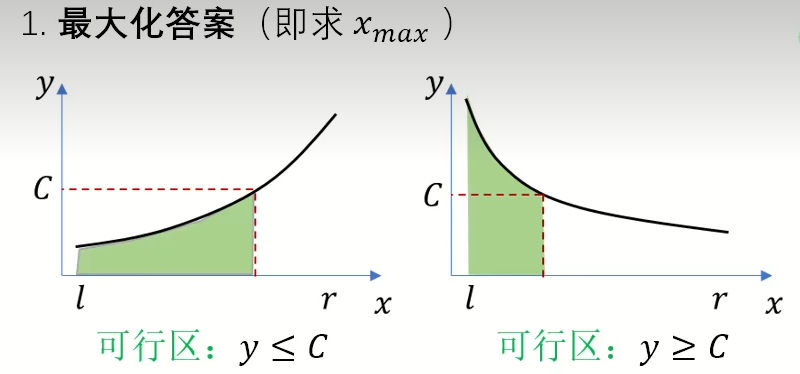
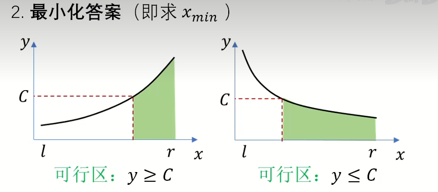

## 二分查找

二分查找一般用于查找数组中$>=x$第一个下标或者最后一个$<=x$的下标，并且$>x$的第一个数可以通过最后一个$<=x$的数下标$+1$得到，同理，找到最后一个$<x$的数,只需要找到第一个$>=x$的数下标$-1$得到，并且实际上$x$的第一个下标和最后一个下标可以就用一个就行

**查找第一个>=target的下标**

```cpp
int lower_bound3(vector<int> &nums, int target) {
    int left = -1, right = nums.size(); // 开区间 (left, right)
    while (left + 1 < right) { // 区间不为空
        // 循环不变量：
        // nums[left] < target
        // nums[right] >= target
        int mid = left + (right - left) / 2;
        if (nums[mid] < target) {
            left = mid; // 范围缩小到 (mid, right)
        } else {
            right = mid; // 范围缩小到 (left, mid)
        }
        // 也可以这样写
        // (nums[mid] < target ? left : right) = mid;
    }
    //right是第一个>=target的
    return right;
}
```

并且如果要找$>=x的$第一个下标和$<=x$的最后一个下标可以看下面

```cpp
vector<int> searchRange(vector<int> &nums, int target) {
    int start = lower_bound(nums, target); // 使用其中一种写法即可
    if (start == nums.size() || nums[start] != target) {
        return {-1, -1};
    }
    // 如果 start 存在，那么 end 必定存在
    // <=x的最后一个，就是>=x + 1的第一个下标-1
    int end = lower_bound(nums, target + 1) - 1;
    return {start, end};
}
```

```python
def lower_bound3(nums: List[int], target: int) -> int:
    left, right = -1, len(nums)  # 开区间 (left, right)
    while left + 1 < right:  # 区间不为空
        mid = (left + right) // 2
        # 循环不变量：
        # nums[left] < target
        # nums[right] >= target
        if nums[mid] < target:
            left = mid  # 范围缩小到 (mid, right)
        else:
            right = mid  # 范围缩小到 (left, mid)
    return right
```

[34. 在排序数组中查找元素的第一个和最后一个位置 - 力扣（LeetCode）](https://leetcode.cn/problems/find-first-and-last-position-of-element-in-sorted-array/description/)

[35. 搜索插入位置 - 力扣（LeetCode）](https://leetcode.cn/problems/search-insert-position/description/)

[704. 二分查找 - 力扣（LeetCode）](https://leetcode.cn/problems/binary-search/description/)

[744. 寻找比目标字母大的最小字母 - 力扣（LeetCode）](https://leetcode.cn/problems/find-smallest-letter-greater-than-target/description/)

[2529. 正整数和负整数的最大计数 - 力扣（LeetCode）](https://leetcode.cn/problems/maximum-count-of-positive-integer-and-negative-integer/description/)

[1385. 两个数组间的距离值 - 力扣（LeetCode）](https://leetcode.cn/problems/find-the-distance-value-between-two-arrays/description/)

[2300. 咒语和药水的成功对数 - 力扣（LeetCode）](https://leetcode.cn/problems/successful-pairs-of-spells-and-potions/description/)

[2389. 和有限的最长子序列 - 力扣（LeetCode）](https://leetcode.cn/problems/longest-subsequence-with-limited-sum/description/)

[1170. 比较字符串最小字母出现频次 - 力扣（LeetCode）](https://leetcode.cn/problems/compare-strings-by-frequency-of-the-smallest-character/description/)

[2080. 区间内查询数字的频率 - 力扣（LeetCode）](https://leetcode.cn/problems/range-frequency-queries/description/)

[2563. 统计公平数对的数目 - 力扣（LeetCode）](https://leetcode.cn/problems/count-the-number-of-fair-pairs/description/)

[2856. 删除数对后的最小数组长度 - 力扣（LeetCode）](https://leetcode.cn/problems/minimum-array-length-after-pair-removals/description/)

[981. 基于时间的键值存储 - 力扣（LeetCode）](https://leetcode.cn/problems/time-based-key-value-store/description/)

[1146. 快照数组 - 力扣（LeetCode）](https://leetcode.cn/problems/snapshot-array/description/)

[1818. 绝对差值和 - 力扣（LeetCode）](https://leetcode.cn/problems/minimum-absolute-sum-difference/description/)

[911. 在线选举 - 力扣（LeetCode）](https://leetcode.cn/problems/online-election/description/)

[LCP 08. 剧情触发时间 - 力扣（LeetCode）](https://leetcode.cn/problems/ju-qing-hong-fa-shi-jian/description/)

## 二分答案模板

二分是一个常见的算法，但是更为常见的是二分答案。二分答案一般是求$x_{max}$或者$x_{min}$的时候，就是最大化答案或者最小化答案，下面是一个基本的板子

**最大化答案** 可以记住最大化答案就是求$l$

```cpp
bool check(int x)
{
    return y <= c; // y随着x单调递增的
    return y >= c; // y虽则x单调递减的
}
int find()
{
    int l = 下界-1, r = 上界 + 1;
    while(l + 1 < r)
    {
        int mid = (l + r)>>1;
        if(check(mid))	l = mid; // 最大化答案
    	else	r = mid;
    }
    return l;
}
```



**最小化答案** 可以记住最大化答案就是求$r$

```cpp
bool check(int x)
{
    return y >= c; // y随着x单调递增的
    return y <= c; // y虽则x单调递减的
}
int find()
{
    int l = 下界-1, r = 上界 + 1;
    while(l + 1 < r)
    {
        int mid = (l + r)>>1;
        if(check(mid))	r = mid; // 最小化答案
    	else	l = mid;
    }
    return r;
}
```



## 二分答案求最小

#### [1283. 使结果不超过阈值的最小除数 - 力扣（LeetCode）](https://leetcode.cn/problems/find-the-smallest-divisor-given-a-threshold/)

二分答案，唯一需要注意的是上取整可以通过$(x+(mid - 1)) // mid$实现

```python
class Solution:
    def smallestDivisor(self, nums: List[int], threshold: int) -> int:
        # 最小化答案
        left, right = 0, max(nums) + 1
        def check(mid):
            sum = 0
            for x in nums:
                sum += (x + mid - 1) // mid
            return sum <= threshold
        while(left + 1 < right):
            mid = (left + right) // 2
            if check(mid):
                right = mid
            else:
                left = mid
        return right
```

#### [2187. 完成旅途的最少时间 - 力扣（LeetCode）](https://leetcode.cn/problems/minimum-time-to-complete-trips/description/)

```python
class Solution:
    def minimumTime(self, time: List[int], totalTrips: int) -> int:
        left, right = 0, 10 ** 7 * min(time)
        def check(mid):
            return sum(mid // x for x in time) >= totalTrips
        while left + 1 < right:
            mid = (left + right) // 2
            if check(mid):
                right = mid
            else:
                left = mid
        return right
```

[1870. 准时到达的列车最小时速 - 力扣（LeetCode）](https://leetcode.cn/problems/minimum-speed-to-arrive-on-time/description/)

[1011. 在 D 天内送达包裹的能力 - 力扣（LeetCode）](https://leetcode.cn/problems/capacity-to-ship-packages-within-d-days/description/)

[875. 爱吃香蕉的珂珂 - 力扣（LeetCode）](https://leetcode.cn/problems/koko-eating-bananas/description/)

[475. 供暖器 - 力扣（LeetCode）](https://leetcode.cn/problems/heaters/description/)

[2594. 修车的最少时间 - 力扣（LeetCode）](https://leetcode.cn/problems/minimum-time-to-repair-cars/description/)

[1482. 制作 m 束花所需的最少天数 - 力扣（LeetCode）](https://leetcode.cn/problems/minimum-number-of-days-to-make-m-bouquets/description/)

[3048. 标记所有下标的最早秒数 I - 力扣（LeetCode）](https://leetcode.cn/problems/earliest-second-to-mark-indices-i/description/)

[3049. 标记所有下标的最早秒数 II - 力扣（LeetCode）](https://leetcode.cn/problems/earliest-second-to-mark-indices-ii/description/)

## 二分答案求最大

#### [275. H 指数 II - 力扣（LeetCode）](https://leetcode.cn/problems/h-index-ii/description/)

二分答案，求的是最大化答案

```python
class Solution:
    def hIndex(self, citations: List[int]) -> int:
        left = 0
        n = len(citations)
        right = len(citations) + 1
        while left + 1 < right:
            mid = (left + right) // 2
            # 如果后面这几篇都>=mid
            if citations[n - mid] >= mid:
                left = mid
            else:
                right = mid
        return left
```

[2226. 每个小孩最多能分到多少糖果 - 力扣（LeetCode）](https://leetcode.cn/problems/maximum-candies-allocated-to-k-children/description/)

[2982. 找出出现至少三次的最长特殊子字符串 II - 力扣（LeetCode）](https://leetcode.cn/problems/find-longest-special-substring-that-occurs-thrice-ii/description/)

[2576. 求出最多标记下标 - 力扣（LeetCode）](https://leetcode.cn/problems/find-the-maximum-number-of-marked-indices/description/)

[1898. 可移除字符的最大数目 - 力扣（LeetCode）](https://leetcode.cn/problems/maximum-number-of-removable-characters/description/)

[1802. 有界数组中指定下标处的最大值 - 力扣（LeetCode）](https://leetcode.cn/problems/maximum-value-at-a-given-index-in-a-bounded-array/description/)

[1642. 可以到达的最远建筑 - 力扣（LeetCode）](https://leetcode.cn/problems/furthest-building-you-can-reach/description/)

[2861. 最大合金数 - 力扣（LeetCode）](https://leetcode.cn/problems/maximum-number-of-alloys/description/)

[3007. 价值和小于等于 K 的最大数字 - 力扣（LeetCode）](https://leetcode.cn/problems/maximum-number-that-sum-of-the-prices-is-less-than-or-equal-to-k/description/)

[2141. 同时运行 N 台电脑的最长时间 - 力扣（LeetCode）](https://leetcode.cn/problems/maximum-running-time-of-n-computers/description/)

[2258. 逃离火灾 - 力扣（LeetCode）](https://leetcode.cn/problems/escape-the-spreading-fire/description/)

[2071. 你可以安排的最多任务数目 - 力扣（LeetCode）](https://leetcode.cn/problems/maximum-number-of-tasks-you-can-assign/description/)

## 二分间接值

二分的不是答案，而是一个和答案有关的值（间接值）。

[3143. 正方形中的最多点数 - 力扣（LeetCode）](https://leetcode.cn/problems/maximum-points-inside-the-square/description/)

[1648. 销售价值减少的颜色球 - 力扣（LeetCode）](https://leetcode.cn/problems/sell-diminishing-valued-colored-balls/description/)

## 最小化最大值

本质是二分答案求最小。

[410. 分割数组的最大值 - 力扣（LeetCode）](https://leetcode.cn/problems/split-array-largest-sum/description/)

[2064. 分配给商店的最多商品的最小值 - 力扣（LeetCode）](https://leetcode.cn/problems/minimized-maximum-of-products-distributed-to-any-store/description/)

[1760. 袋子里最少数目的球 - 力扣（LeetCode）](https://leetcode.cn/problems/minimum-limit-of-balls-in-a-bag/description/)

[1631. 最小体力消耗路径 - 力扣（LeetCode）](https://leetcode.cn/problems/path-with-minimum-effort/description/)

[2439. 最小化数组中的最大值 - 力扣（LeetCode）](https://leetcode.cn/problems/minimize-maximum-of-array/description/)

[2560. 打家劫舍 IV - 力扣（LeetCode）](https://leetcode.cn/problems/house-robber-iv/description/)

[778. 水位上升的泳池中游泳 - 力扣（LeetCode）](https://leetcode.cn/problems/swim-in-rising-water/description/)

[2616. 最小化数对的最大差值 - 力扣（LeetCode）](https://leetcode.cn/problems/minimize-the-maximum-difference-of-pairs/description/)

[2513. 最小化两个数组中的最大值 - 力扣（LeetCode）](https://leetcode.cn/problems/minimize-the-maximum-of-two-arrays/description/)

[LCP 12. 小张刷题计划 - 力扣（LeetCode）](https://leetcode.cn/problems/xiao-zhang-shua-ti-ji-hua/description/)

## 最大化最小值

本质是二分答案求最大。

[2517. 礼盒的最大甜蜜度 - 力扣（LeetCode）](https://leetcode.cn/problems/maximum-tastiness-of-candy-basket/description/)

[1552. 两球之间的磁力 - 力扣（LeetCode）](https://leetcode.cn/problems/magnetic-force-between-two-balls/description/)

[2812. 找出最安全路径 - 力扣（LeetCode）](https://leetcode.cn/problems/find-the-safest-path-in-a-grid/description/)

[2528. 最大化城市的最小电量 - 力扣（LeetCode）](https://leetcode.cn/problems/maximize-the-minimum-powered-city/description/)

## 第 K 小/大

部分题目也可以用堆解决。

[378. 有序矩阵中第 K 小的元素 - 力扣（LeetCode）](https://leetcode.cn/problems/kth-smallest-element-in-a-sorted-matrix/description/)

[668. 乘法表中第k小的数 - 力扣（LeetCode）](https://leetcode.cn/problems/kth-smallest-number-in-multiplication-table/description/)

[719. 找出第 K 小的数对距离 - 力扣（LeetCode）](https://leetcode.cn/problems/find-k-th-smallest-pair-distance/description/)

[878. 第 N 个神奇数字 - 力扣（LeetCode）](https://leetcode.cn/problems/nth-magical-number/description/)

[1201. 丑数 III - 力扣（LeetCode）](https://leetcode.cn/problems/ugly-number-iii/description/)

[793. 阶乘函数后 K 个零 - 力扣（LeetCode）](https://leetcode.cn/problems/preimage-size-of-factorial-zeroes-function/description/)

[373. 查找和最小的 K 对数字 - 力扣（LeetCode）](https://leetcode.cn/problems/find-k-pairs-with-smallest-sums/description/)

[1439. 有序矩阵中的第 k 个最小数组和 - 力扣（LeetCode）](https://leetcode.cn/problems/find-the-kth-smallest-sum-of-a-matrix-with-sorted-rows/description/)

[786. 第 K 个最小的质数分数 - 力扣（LeetCode）](https://leetcode.cn/problems/k-th-smallest-prime-fraction/description/)

[3116. 单面值组合的第 K 小金额 - 力扣（LeetCode）](https://leetcode.cn/problems/kth-smallest-amount-with-single-denomination-combination/description/)

[3134. 找出唯一性数组的中位数 - 力扣（LeetCode）](https://leetcode.cn/problems/find-the-median-of-the-uniqueness-array/description/)

[2040. 两个有序数组的第 K 小乘积 - 力扣（LeetCode）](https://leetcode.cn/problems/kth-smallest-product-of-two-sorted-arrays/description/)

[2386. 找出数组的第 K 大和 - 力扣（LeetCode）](https://leetcode.cn/problems/find-the-k-sum-of-an-array/description/)

[1508. 子数组和排序后的区间和 - 力扣（LeetCode）](https://leetcode.cn/problems/range-sum-of-sorted-subarray-sums/description/)

## 其他

[2476. 二叉搜索树最近节点查询 - 力扣（LeetCode）](https://leetcode.cn/problems/closest-nodes-queries-in-a-binary-search-tree/description/)

[74. 搜索二维矩阵 - 力扣（LeetCode）](https://leetcode.cn/problems/search-a-2d-matrix/description/)

[240. 搜索二维矩阵 II - 力扣（LeetCode）](https://leetcode.cn/problems/search-a-2d-matrix-ii/description/)

[278. 第一个错误的版本 - 力扣（LeetCode）](https://leetcode.cn/problems/first-bad-version/description/)

[374. 猜数字大小 - 力扣（LeetCode）](https://leetcode.cn/problems/guess-number-higher-or-lower/description/)

[162. 寻找峰值 - 力扣（LeetCode）](https://leetcode.cn/problems/find-peak-element/description/)

[1901. 寻找峰值 II - 力扣（LeetCode）](https://leetcode.cn/problems/find-a-peak-element-ii/description/)

[852. 山脉数组的峰顶索引 - 力扣（LeetCode）](https://leetcode.cn/problems/peak-index-in-a-mountain-array/description/)

[1095. 山脉数组中查找目标值 - 力扣（LeetCode）](https://leetcode.cn/problems/find-in-mountain-array/description/)

[153. 寻找旋转排序数组中的最小值 - 力扣（LeetCode）](https://leetcode.cn/problems/find-minimum-in-rotated-sorted-array/description/)

[33. 搜索旋转排序数组 - 力扣（LeetCode）](https://leetcode.cn/problems/search-in-rotated-sorted-array/description/)

[1539. 第 k 个缺失的正整数 - 力扣（LeetCode）](https://leetcode.cn/problems/kth-missing-positive-number/description/)

[540. 有序数组中的单一元素 - 力扣（LeetCode）](https://leetcode.cn/problems/single-element-in-a-sorted-array/description/)

[4. 寻找两个正序数组的中位数 - 力扣（LeetCode）](https://leetcode.cn/problems/median-of-two-sorted-arrays/description/)

